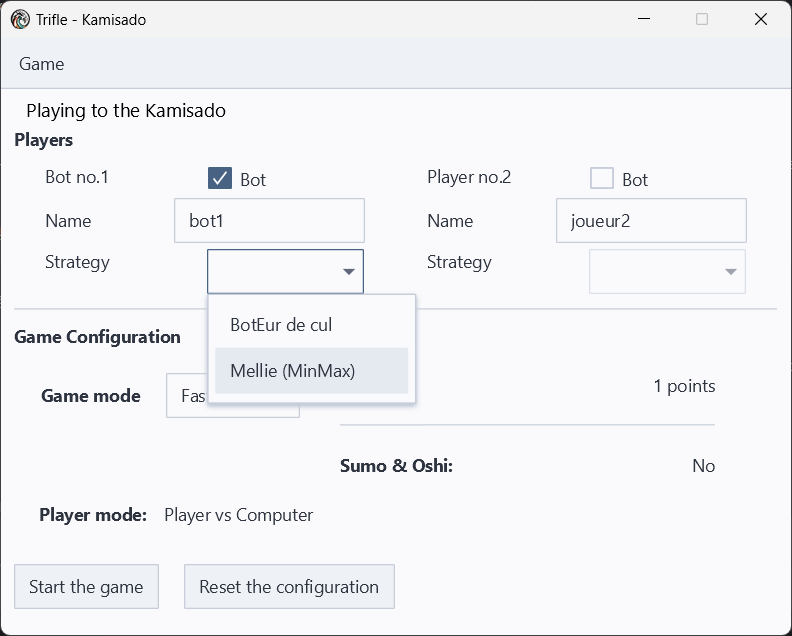
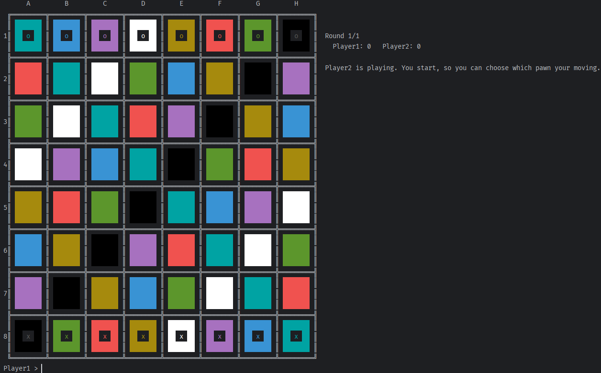
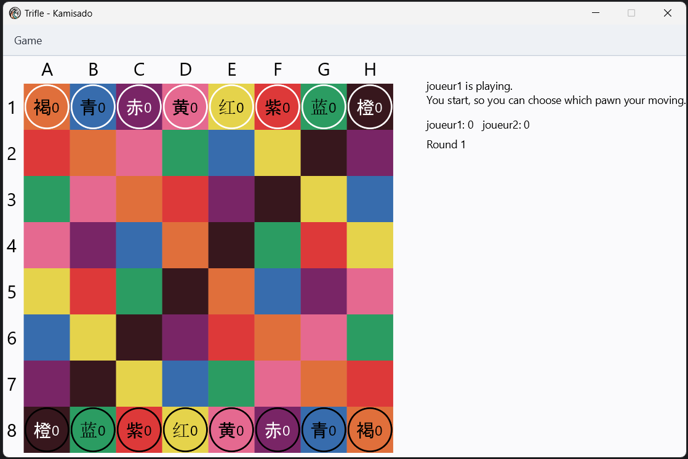
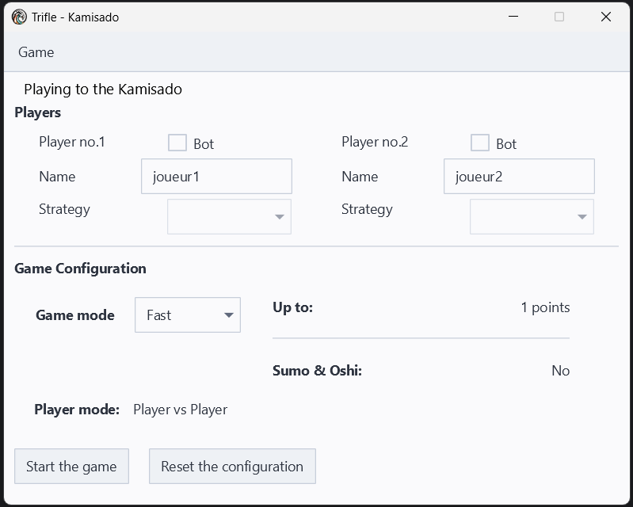
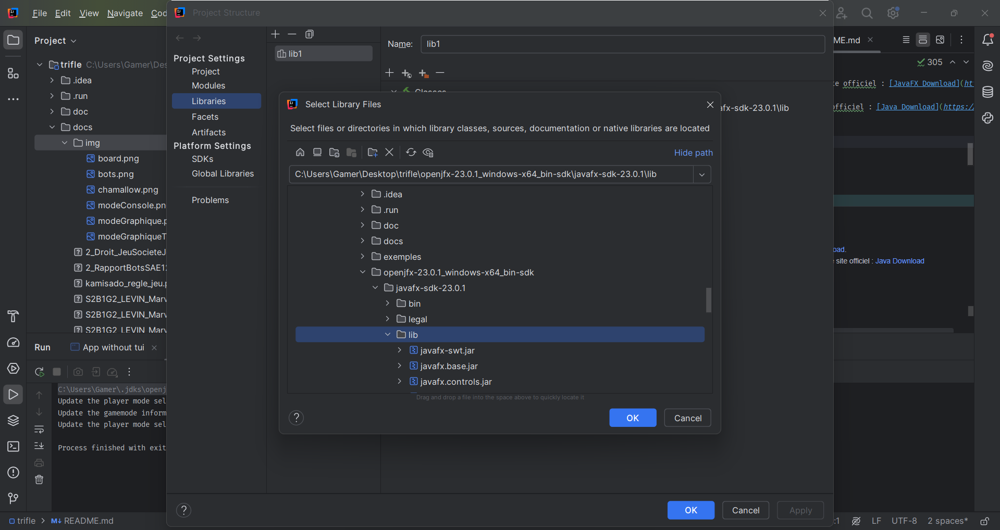
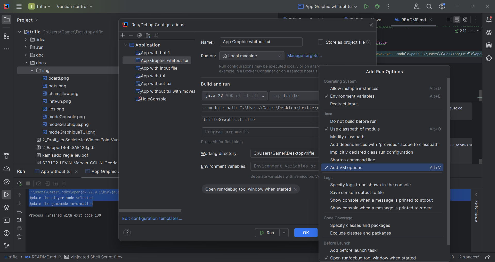

# Equipe Chamallow - Projet BUT Informatique Trifle - 18/02/2024 18/06/2024


## Informations Equipe
- **Membres** :
  - [Cédric COLIN](https://github.com/lynn2910)
  - [Marvyn LEVIN](https://github.com/marvynlevin)
  - Hugues ESTRADE
  - [Timothée MEYER](https://github.com/Spaceiii)
  - [Baptiste DULIEUX](https://github.com/baptisteDULIEUX)
- **Objectif** : L'objectif de ce projet est de créer une version numérique du jeu de stratégie Kamisado en utilisant Java, avec une interface interactive via JavaFX. Il inclut l’implémentation d’une intelligence artificielle (bot de différents niveaux de difficulté), la séparation des responsabilités via une architecture MVC, et des tests unitaires pour assurer la fiabilité du code.

## Documents liés au projet
- [Rapport général-pdf](./docs/S2B1G2_LEVIN_Marvyn_COLIN_Cedric_DULIEUX_Baptiste_MEYER_Timothee_ESTRADE_Hugues_rapportGeneral.pdf) [Participation-xlsx](./docs/S2B1G2_LEVIN_Marvyn_COLIN_Cedric_DULIEUX_Baptiste_MEYER_Timothee_ESTRADE_Hugues_participation.xlsx) [Participation-pdf](./docs/S2B1G2_LEVIN_Marvyn_COLIN_Cedric_DULIEUX_Baptiste_MEYER_Timothee_ESTRADE_Hugues_participation.pdf)
- [Rapport Bots-pdf](./docs/2_RapportBotsSAE126.pdf)
- [Droit Jeu de société et Point de Vue Juridique-pdf](./docs/2_Droit_JeuSocieteJeuVideosPointVueJuridique.pdf)
- [Soutenance-pdf](./docs/S2B1G2_LEVIN_Marvyn_COLIN_Cedric_DULIEUX_Baptiste_MEYER_Timothee_ESTRADE_Hugues_diaporama.pdf) [Soutenance-pptx](./docs/S2B1G2_LEVIN_Marvyn_COLIN_Cedric_DULIEUX_Baptiste_MEYER_Timothee_ESTRADE_Hugues_diaporama.pptx)

## Cahier des charges

### 1. Présentation du Projet
- **But :** Créer une version numérique du jeu Kamisado qui conserve les aspects stratégiques et interactifs du jeu de société original, avec des options pour jouer seul ou à plusieurs et une interface conviviale.
- **Moyens :** Développer en **Java** pour une version console accessible et intégrant JavaFX pour un mode graphique amélioré, offrant aux utilisateurs une expérience visuelle et interactive.
- **Objectifs du Système :**
  - **Intelligence Artificielle (IA) :** Concevoir plusieurs niveaux de difficulté pour le bot, permettant aux utilisateurs de jouer contre une IA adaptative et d'affronter un adversaire de niveau égal ou supérieur. Les algorithmes de l'IA intègrent des stratégies spécifiques du jeu Kamisado, où chaque pion déclenche des actions spécifiques qui sont optimisées en fonction du niveau choisi.
  - **Modes de Jeu :** Offrir des modes "Humain vs Humain", "Humain vs Ordinateur", et "Ordinateur vs Ordinateur". En mode Console, le jeu propose un affichage en TTY, et en mode Graphique, une interface JavaFX pour une expérience plus immersive. Ces modes permettent une flexibilité dans la manière de jouer tout en offrant des configurations de jeu personnalisables pour chaque type de joueur.
  - **Tests Unitaires et Validation :** Utiliser JUnit5 et Mockito pour des tests unitaires afin d’assurer la fiabilité et la robustesse du code. Les tests couvrent les éléments critiques tels que les déplacements de pions, la logique de l’IA, et les fonctionnalités de l'interface utilisateur pour garantir un comportement attendu.

### 2. Types de fichiers
- **Java (class)** : Contient toutes les classes Java pour la logique du jeu Kamisado, organisées selon le modèle MVC (Modèle-Vue-Contrôleur) pour une séparation claire des responsabilités et une meilleure maintenance du code.
- **Tests (JUnit5 et Mockito)** : Fichiers dédiés aux tests unitaires et tests de groupe, utilisant JUnit5 pour valider la logique du jeu et Mockito pour simuler des interactions complexes. Ces tests garantissent la fiabilité et la robustesse des fonctionnalités, comme le comportement des pions, les règles de déplacement, et la performance de l'IA à différents niveaux de difficulté.
- **JavaFX (interface graphique)** : Fichiers pour la mise en place de l’interface graphique, utilisant JavaFX pour offrir un affichage interactif des parties. Ils incluent des éléments visuels pour le plateau de jeu, les pions, et les interactions utilisateur.


### Recherche Documentaire
- **Ressources** :
  - [Kamisado règles jeu-pdf](./docs/kamisado_regle_jeu.pdf)

### 4. Répartition du Travail
- **Marvyn LEVIN** :
  - Bot n°1, logique des règles complexes, sumo, oshi
- **Cédric COLIN** :
  - Bot n°1, logique basique du jeu, vidéo de démonstration
- **Hugues ESTRADE** :
  - Stratégies pour les bots
- **Baptiste DULIEUX** :
  - Tests unitaires, implémentation des règles complexes
- **Timothée MEYER** :
  - Bot n°2, présentation de la soutenance

## Concept de Conception

### Architecture MVC
Le projet adopte le modèle d’architecture MVC (Modèle-Vue-Contrôleur) pour séparer clairement les responsabilités. Cela permet de maintenir une structure de code propre et modulaire, facilitant ainsi l'évolution et les tests. Le Modèle gère la logique du jeu, la Vue s'occupe de l'affichage et l'interaction avec l'utilisateur, tandis que le Contrôleur traite les entrées de l'utilisateur et communique entre le Modèle et la Vue.

### Intelligence Artificielle
L’intelligence artificielle (IA) est conçue pour offrir différents niveaux de difficulté, permettant ainsi aux joueurs de choisir un adversaire adapté à leurs compétences. L'IA utilise des algorithmes de recherche et des heuristiques pour évaluer les meilleures coups possibles, rendant le jeu plus engageant.


### Inspiration et Conception Visuelle
L'interface utilisateur présentée permet aux utilisateurs de naviguer facilement à travers le jeu, avec une représentation visuelle claire du plateau de Kamisado. Les couleurs des pions et du plateau sont inspirées des éléments visuels traditionnels du jeu, offrant ainsi une expérience immersive. De plus, l'utilisation de JavaFX permet de créer des animations fluides pour les déplacements des pions, améliorant l’interaction et le plaisir de jouer.
 

### Considérations Ergonomiques
Nous avons également porté une attention particulière à l’ergonomie de l’interface. Les boutons sont clairement étiquetés et facilement accessibles, et des aides contextuelles sont disponibles pour guider les nouveaux joueurs. Des tests utilisateurs ont été réalisés pour optimiser l’expérience et s'assurer que l'interface est intuitive et réactive.


## Instructions d'Exécution sur Windows

### Étapes d'Installation

1. **Installation de JavaFX 23.0.1 :**  
   Téléchargez et installez JavaFX 23.0.1 depuis le site officiel : [JavaFX Download](https://download2.gluonhq.com/openjfx/23.0.1/openjfx-23.0.1_windows-x64_bin-sdk.zip).
2. **Installation de Java JDK17 :**
   Téléchargez et installez Java JDK17 depuis le site officiel : [Java Download](https://download.oracle.com/java/17/archive/jdk-17.0.12_windows-x64_bin.exe)

### Configuration de JavaFX (libs)


### Instructions d'Exécution

```shell
# Clonez le jeu
git clone https://gitlab.iut-bm.univ-fcomte.fr/ccolin2/trifleConsole.git

# Compilez le jeu
javac -d out src/**/*.java
```

### Configuration des modes de jeu

#### Avec commandes shell
Avec le TUI (interface texte) :
```shell
java -cp out trifleConsole.TrifleConsole
```

Sans TUI (configurations par défaut) :
```shell
java -cp out trifleConsole.TrifleConsole 0
# Modes : 0 = Humain vs Humain, 1 = Humain vs IA, 2 = IA vs IA
```

Enregistrement des mouvements :
```shell
java -cp out trifleConsole.TrifleConsole --output-moves ./move_file.in
```
#### Avec l'interface Configuration de JetBrains



Ajoutez dans le champ
```shell
--module-path C:\path\trifle\openjfx-23.0.1_windows-x64_bin-sdk\javafx-sdk-23.0.1\lib --add-modules=javafx.base,javafx.controls,javafx.fxml,javafx.graphics,javafx.media,javafx.swing,javafx.web
```

> **Note :** Utilisez IntelliJ IDEA pour exécuter les tests JUnit.

> **Astuce :** Pour ralentir l'IA, définissez `WAIT_BEFORE_END=5000` dans les variables d'environnement (pause de 5s).


### Jeu lancé en mode Console et Graphique
```bash
      A         B         C         D         E         F         G         H                                                                               
 ╔═════════╦═════════╦═════════╦═════════╦═════════╦═════════╦═════════╦═════════╗                                                                          
 ║         ║         ║         ║         ║         ║         ║         ║         ║                                                                          
1║    o    ║    o    ║    o    ║    o    ║    o    ║    o    ║    o    ║    o    ║  Round 1/1                                                               
 ║         ║         ║         ║         ║         ║         ║         ║         ║    Player1: 0   Player2: 0                                               
 ╠═════════╬═════════╬═════════╬═════════╬═════════╬═════════╬═════════╬═════════╣                                                                          
 ║         ║         ║         ║         ║         ║         ║         ║         ║  Player2 is playing. You start, so you can choose which pawn your moving.
2║         ║         ║         ║         ║         ║         ║         ║         ║                                                                          
 ║         ║         ║         ║         ║         ║         ║         ║         ║                                                                          
 ╠═════════╬═════════╬═════════╬═════════╬═════════╬═════════╬═════════╬═════════╣                                                                          
 ║         ║         ║         ║         ║         ║         ║         ║         ║                                                                          
3║         ║         ║         ║         ║         ║         ║         ║         ║                                                                          
 ║         ║         ║         ║         ║         ║         ║         ║         ║                                                                          
 ╠═════════╬═════════╬═════════╬═════════╬═════════╬═════════╬═════════╬═════════╣                                                                          
 ║         ║         ║         ║         ║         ║         ║         ║         ║                                                                          
4║         ║         ║         ║         ║         ║         ║         ║         ║                                                                          
 ║         ║         ║         ║         ║         ║         ║         ║         ║                                                                          
 ╠═════════╬═════════╬═════════╬═════════╬═════════╬═════════╬═════════╬═════════╣                                                                          
 ║         ║         ║         ║         ║         ║         ║         ║         ║                                                                          
5║         ║         ║         ║         ║         ║         ║         ║         ║                                                                          
 ║         ║         ║         ║         ║         ║         ║         ║         ║                                                                          
 ╠═════════╬═════════╬═════════╬═════════╬═════════╬═════════╬═════════╬═════════╣                                                                          
 ║         ║         ║         ║         ║         ║         ║         ║         ║                                                                          
6║         ║         ║         ║         ║         ║         ║         ║         ║                                                                          
 ║         ║         ║         ║         ║         ║         ║         ║         ║                                                                          
 ╠═════════╬═════════╬═════════╬═════════╬═════════╬═════════╬═════════╬═════════╣                                                                          
 ║         ║         ║         ║         ║         ║         ║         ║         ║                                                                          
7║         ║         ║         ║         ║         ║         ║         ║         ║                                                                          
 ║         ║         ║         ║         ║         ║         ║         ║         ║                                                                          
 ╠═════════╬═════════╬═════════╬═════════╬═════════╬═════════╬═════════╬═════════╣                                                                          
 ║         ║         ║         ║         ║         ║         ║         ║         ║                                                                          
8║    x    ║    x    ║    x    ║    x    ║    x    ║    x    ║    x    ║    x    ║                                                                          
 ║         ║         ║         ║         ║         ║         ║         ║         ║                                                                          
 ╚═════════╩═════════╩═════════╩═════════╩═════════╩═════════╩═════════╩═════════╝                                                                          
Player1 > 
```

```shell
C:\Users\X\.jdks\openjdk-22.0.1\bin\java.exe --module-path C:\Users\X\Desktop\trifle\openjfx-23.0.1_windows-x64_bin-sdk\javafx-sdk-23.0.1\lib --add-modules=javafx.base,javafx.controls,javafx.fxml,javafx.graphics,javafx.media,javafx.swing,javafx.web "-javaagent:C:\Users\Gamer\AppData\Local\Programs\IntelliJ IDEA Ultimate\lib\idea_rt.jar=49347:C:\Users\Gamer\AppData\Local\Programs\IntelliJ IDEA Ultimate\bin" -Dfile.encoding=UTF-8 -Dsun.stdout.encoding=UTF-8 -Dsun.stderr.encoding=UTF-8 -classpath C:\Users\X\Desktop\trifle\out\production\trifle;C:\Users\X\Desktop\trifle\openjfx-23.0.1_windows-x64_bin-sdk\javafx-sdk-23.0.1\lib\javafx-swt.jar;C:\Users\X\Desktop\trifle\openjfx-23.0.1_windows-x64_bin-sdk\javafx-sdk-23.0.1\lib\javafx.web.jar;C:\Users\X\Desktop\trifle\openjfx-23.0.1_windows-x64_bin-sdk\javafx-sdk-23.0.1\lib\javafx.base.jar;C:\Users\X\Desktop\trifle\openjfx-23.0.1_windows-x64_bin-sdk\javafx-sdk-23.0.1\lib\javafx.fxml.jar;C:\Users\X\Desktop\trifle\openjfx-23.0.1_windows-x64_bin-sdk\javafx-sdk-23.0.1\lib\javafx.media.jar;C:\Users\X\Desktop\trifle\openjfx-23.0.1_windows-x64_bin-sdk\javafx-sdk-23.0.1\lib\javafx.swing.jar;C:\Users\X\Desktop\trifle\openjfx-23.0.1_windows-x64_bin-sdk\javafx-sdk-23.0.1\lib\javafx.controls.jar;C:\Users\X\Desktop\trifle\openjfx-23.0.1_windows-x64_bin-sdk\javafx-sdk-23.0.1\lib\javafx.graphics.jar trifleGraphic.Trifle
Update the player mode selected
Update the gamemode information
```
